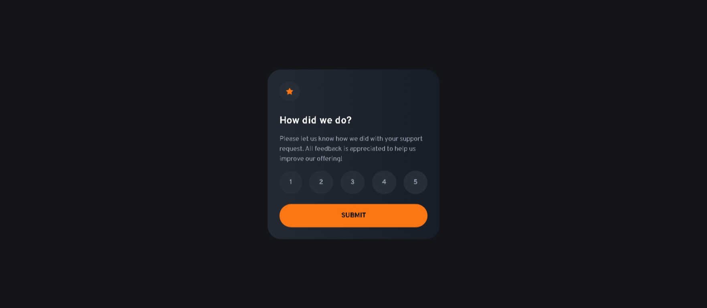

# Frontend Mentor - Interactive Rating Component Solution

This is my solution to the [Interactive rating component challenge on Frontend Mentor](https://www.frontendmentor.io/challenges/interactive-rating-component-koxpeBUmI). It helped me sharpen my CSS layout skills using TailwindCSS and practice basic DOM manipulation using vanilla JavaScript.

## Table of Contents

- [Frontend Mentor - Interactive Rating Component Solution](#frontend-mentor---interactive-rating-component-solution)
  - [Table of Contents](#table-of-contents)
  - [Overview](#overview)
    - [The challenge](#the-challenge)
    - [Screenshot](#screenshot)
    - [Links](#links)
  - [My process](#my-process)
    - [Built with](#built-with)
    - [What I learned](#what-i-learned)
    - [Continued development](#continued-development)
    - [Useful resources](#useful-resources)
  - [Author](#author)

## Overview

### The challenge

Users should be able to:

- View the optimal layout for the app depending on their device's screen size
- See hover states for all interactive elements on the page
- Select and submit a number rating
- See the "Thank you" card state after submitting a rating

### Screenshot



### Links

- **Solution URL:** [FrontendMentor](https://www.frontendmentor.io/solutions/interactive-rating-component-tailwindcss-Kh3YRVNiWj)
- **Live site URL:** [Live Preview](https://interactive-rating-component-seven-lyart.vercel.app/)

## My process

### Built with

- Semantic HTML5
- Tailwind CSS
- Mobile-first design
- Vanilla JavaScript (no frameworks)
- CSS Flexbox and utility classes

### What I learned

- A more advanced way to use `peer` and `has-[]` pseudo-class variants in TailwindCSS to style labels based on input states.
- Managing simple UI state transitions using JavaScript (show/hide cards based on form submission).

Example snippet:

```js
form.addEventListener('submit', (e) => {
  e.preventDefault();
  const selectedRating = document.querySelector('input[name="rating"]:checked');
  if (selectedRating) {
    ratingMessage.textContent = `You selected ${selectedRating.value} out of 5`;
    ratingCard.style.display = 'none';
    thankYouCard.style.display = 'block';
  } else {
    alert('Please select a rating before submitting.');
  }
});
```

### Continued development

I'd like to explore:

- Improving accessibility with keyboard navigation and ARIA labels
- Animating the card transition with Tailwind's `transition` utilities
- Replacing `display: none`/`block` with better utility-based conditionals

### Useful resources

- [TailwindCSS Documentation](https://tailwindcss.com/docs) – My go-to resource for all styling and utility class configurations.

## Author

- Frontend Mentor – [@fawaziwalewa](https://www.frontendmentor.io/profile/fawaziwalewa)
- GitHub – [fawaziwalewa](https://github.com/fawaziwalewa)
- Website – [iwaola.me](https://iwaola.me)
